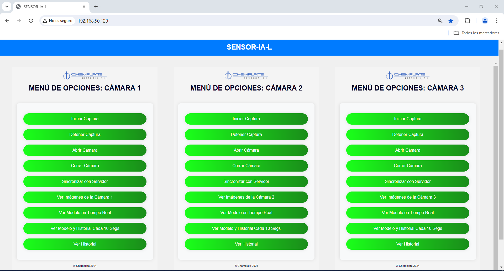

# SENSOR-IA-L

Bachelor's Degree Final Project of Computer Science

## Abstract

### Capturas de Pantalla

| Estado Inicial | Agitación de Prueba |
|:--------------:|:-------------------:|
|  |  |

| Alta Espuma | Baja Espuma |
|:-----------:|:-----------:|
|  |  |

| Foto 1 | Foto 2 (Pequeña) |
|:------:|:----------------:|
|  |  |

| Web Linkeada |
|:------------:|
|  |

