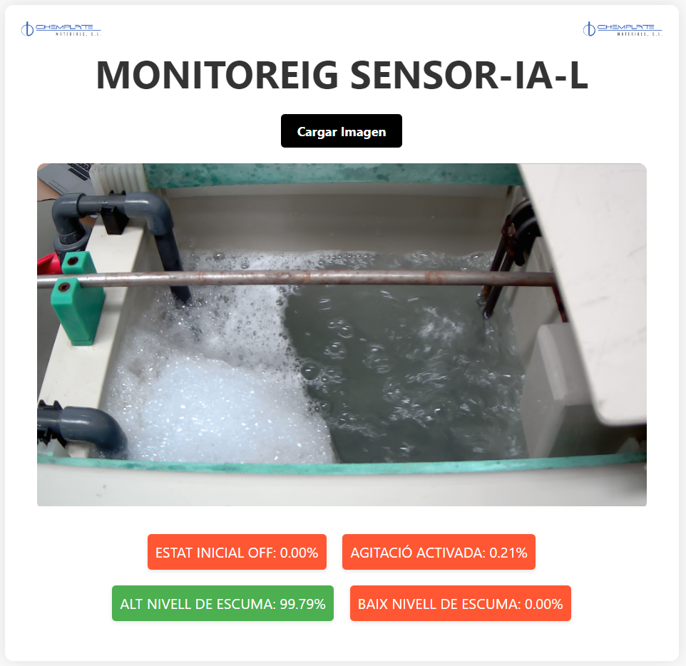

# SENSOR-IA-L

Breve descripción de lo que hace el proyecto y para qué sirve.

## Abstract

# SENSOR-IA-L

Breve descripción de lo que hace el proyecto y para qué sirve.

## Abstract

#### Estado Inicial

#### Agitación de Prueba

#### Alta Espuma

#### Baja Espuma

#### Foto 1

