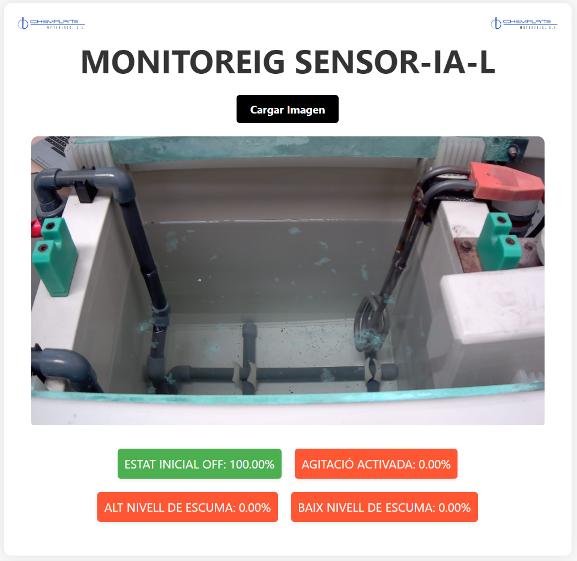
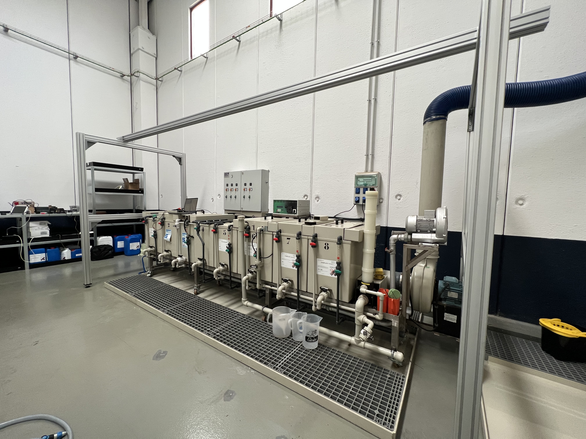

# SENSOR-IA-L

| Bachelor's Degree Final Project of Computer Science | Universidad Autónoma de Barcelona |
|:-------------------:|:-------------------:|
|  | |

## Resum
Aquest Treball de Final de Grau presenta el desenvolupament d'un sistema de monitoratge avançat per a línies de producció química mitjançant tècniques de visió per computador i deep learning amb col·laboració amb l’empresa Chemplate Materials, com a objectiu de supervisar cubetes amb líquids químics per detectar anomalies dins d’un procés de galvanització. Per a això, s’ha creat tot un projecte d’IoT on s’han utilitzat càmeres connectades a Raspberrys Pi Zero 2, capturant més de 100.000 imatges que s’han organitzat en un dataset per posteriorment la creació de tres models de classificació d’imatges per a tres estacions de la línia en concret. S’han entrenat diversos models de deep learning amb l’ús de transfer learning, seleccionant finalment el model Xception per la seva eficiència en la classificació d'imatges. La interfície del sistema, desenvolupada com una pàgina web, permet el control i la visualització remota de les càmeres i dels resultats de la classificació.

## Abstract
This Final Degree Project presents the development of an advanced monitoring system for chemical production lines using computer vision and deep learning techniques, in collaboration with Chemplate Materials. The aim is to supervise tanks containing chemical liquids to detect anomalies within a galvanization process. An entire IoT project was created, utilizing cameras connected to Raspberry Pi Zero 2 units, capturing over 100,000 images organized into a dataset for the subsequent creation of three image classification models for specific stations in the line. Several deep learning models were trained using transfer learning, ultimately selecting the Xception model for its efficiency in image classification. The system interface, developed as a web page, allows remote control and visualization of the cameras and classification results.

### Imágenes

| Estado Inicial | Agitación de Prueba |
|:--------------:|:-------------------:|
|  |  |

| Alta Espuma | Baja Espuma |
|:-----------:|:-----------:|
|  |  |

| Foto 1 | Foto 2 |
|:------:|:----------------:|
|  |  |

| Web Linkeada |
|:------------:|
|  |

